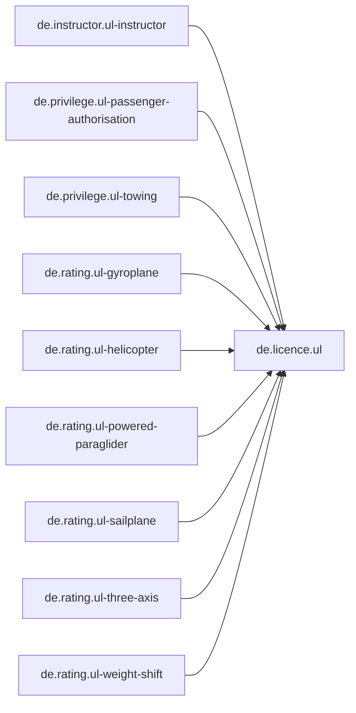
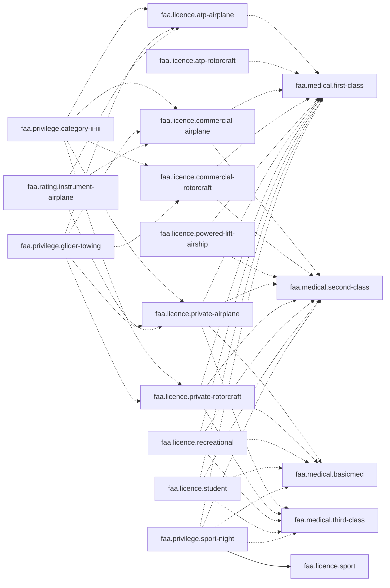
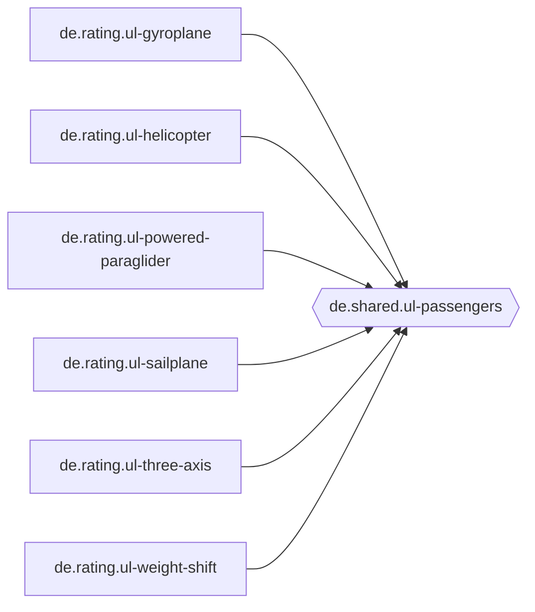

```mermaid
flowchart LR
  easa_endorsement_language_proficiency["easa.endorsement.language-proficiency"]
  easa_examiner_fcl_examiner["easa.examiner.fcl-examiner"]
  easa_examiner_fe_s["easa.examiner.fe-s"]
  easa_instructor_cri["easa.instructor.cri"]
  easa_instructor_fi["easa.instructor.fi"]
  easa_instructor_fi_s["easa.instructor.fi-s"]
  easa_instructor_fti["easa.instructor.fti"]
  easa_instructor_iri["easa.instructor.iri"]
  easa_instructor_mi["easa.instructor.mi"]
  easa_instructor_tri["easa.instructor.tri"]
  easa_licence_atpl_a["easa.licence.atpl-a"]
  easa_licence_atpl_h["easa.licence.atpl-h"]
  easa_licence_bpl["easa.licence.bpl"]
  easa_licence_cpl_a["easa.licence.cpl-a"]
  easa_licence_cpl_as["easa.licence.cpl-as"]
  easa_licence_cpl_h["easa.licence.cpl-h"]
  easa_licence_gpl["easa.licence.gpl"]
  easa_licence_lapl_a["easa.licence.lapl-a"]
  easa_licence_lapl_h["easa.licence.lapl-h"]
  easa_licence_mpl["easa.licence.mpl"]
  easa_licence_ppl_a["easa.licence.ppl-a"]
  easa_licence_ppl_as["easa.licence.ppl-as"]
  easa_licence_ppl_h["easa.licence.ppl-h"]
  easa_licence_spl["easa.licence.spl"]
  easa_medical_class_1["easa.medical.class-1"]
  easa_medical_class_2["easa.medical.class-2"]
  easa_medical_lapl["easa.medical.lapl"]
  easa_privilege_cloud_flying["easa.privilege.cloud-flying"]
  easa_privilege_fcl_banner_towing["easa.privilege.fcl-banner-towing"]
  easa_privilege_fcl_sailplane_towing["easa.privilege.fcl-sailplane-towing"]
  easa_privilege_mountain["easa.privilege.mountain"]
  easa_privilege_sfcl_banner_towing["easa.privilege.sfcl-banner-towing"]
  easa_privilege_sfcl_launch_methods["easa.privilege.sfcl-launch-methods"]
  easa_privilege_sfcl_sailplane_towing["easa.privilege.sfcl-sailplane-towing"]
  easa_privilege_spl_tmg["easa.privilege.spl-tmg"]
  easa_rating_aeroplane_type["easa.rating.aeroplane-type"]
  easa_rating_airship_type["easa.rating.airship-type"]
  easa_rating_bir["easa.rating.bir"]
  easa_rating_helicopter_type["easa.rating.helicopter-type"]
  easa_rating_ir_a["easa.rating.ir-a"]
  easa_rating_ir_as["easa.rating.ir-as"]
  easa_rating_ir_h["easa.rating.ir-h"]
  easa_rating_mep_land["easa.rating.mep-land"]
  easa_rating_mep_sea["easa.rating.mep-sea"]
  easa_rating_powered_lift_type["easa.rating.powered-lift-type"]
  easa_rating_sep_land["easa.rating.sep-land"]
  easa_rating_sep_sea["easa.rating.sep-sea"]
  easa_rating_set_land["easa.rating.set-land"]
  easa_rating_set_sea["easa.rating.set-sea"]
  easa_rating_tmg["easa.rating.tmg"]
  easa_examiner_fcl_examiner -.-> easa_licence_atpl_a
  easa_examiner_fcl_examiner -.-> easa_licence_atpl_h
  easa_examiner_fcl_examiner -.-> easa_licence_cpl_a
  easa_examiner_fcl_examiner -.-> easa_licence_cpl_as
  easa_examiner_fcl_examiner -.-> easa_licence_cpl_h
  easa_examiner_fcl_examiner -.-> easa_licence_gpl
  easa_examiner_fcl_examiner -.-> easa_licence_lapl_a
  easa_examiner_fcl_examiner -.-> easa_licence_lapl_h
  easa_examiner_fcl_examiner -.-> easa_licence_mpl
  easa_examiner_fcl_examiner -.-> easa_licence_ppl_a
  easa_examiner_fcl_examiner -.-> easa_licence_ppl_as
  easa_examiner_fcl_examiner -.-> easa_licence_ppl_h
  easa_examiner_fe_s -.-> easa_licence_spl
  easa_instructor_cri -.-> easa_licence_atpl_a
  easa_instructor_cri -.-> easa_licence_cpl_a
  easa_instructor_cri -.-> easa_licence_mpl
  easa_instructor_cri -.-> easa_licence_ppl_a
  easa_instructor_fi -.-> easa_licence_atpl_a
  easa_instructor_fi -.-> easa_licence_atpl_h
  easa_instructor_fi -.-> easa_licence_cpl_a
  easa_instructor_fi -.-> easa_licence_cpl_as
  easa_instructor_fi -.-> easa_licence_cpl_h
  easa_instructor_fi -.-> easa_licence_gpl
  easa_instructor_fi -.-> easa_licence_lapl_a
  easa_instructor_fi -.-> easa_licence_lapl_h
  easa_instructor_fi -.-> easa_licence_mpl
  easa_instructor_fi -.-> easa_licence_ppl_a
  easa_instructor_fi -.-> easa_licence_ppl_as
  easa_instructor_fi -.-> easa_licence_ppl_h
  easa_instructor_fi_s -.-> easa_licence_spl
  easa_instructor_fti -.-> easa_licence_atpl_a
  easa_instructor_fti -.-> easa_licence_atpl_h
  easa_instructor_fti -.-> easa_licence_cpl_a
  easa_instructor_fti -.-> easa_licence_cpl_h
  easa_instructor_fti -.-> easa_licence_lapl_a
  easa_instructor_fti -.-> easa_licence_lapl_h
  easa_instructor_fti -.-> easa_licence_mpl
  easa_instructor_fti -.-> easa_licence_ppl_a
  easa_instructor_fti -.-> easa_licence_ppl_h
  easa_instructor_iri -.-> easa_licence_atpl_a
  easa_instructor_iri -.-> easa_licence_atpl_h
  easa_instructor_iri -.-> easa_licence_cpl_a
  easa_instructor_iri -.-> easa_licence_cpl_as
  easa_instructor_iri -.-> easa_licence_cpl_h
  easa_instructor_iri -.-> easa_licence_mpl
  easa_instructor_iri -.-> easa_licence_ppl_a
  easa_instructor_iri -.-> easa_licence_ppl_as
  easa_instructor_iri -.-> easa_licence_ppl_h
  easa_instructor_mi -.-> easa_instructor_cri
  easa_instructor_mi -.-> easa_instructor_fi
  easa_instructor_mi -.-> easa_instructor_tri
  easa_instructor_tri -.-> easa_licence_atpl_a
  easa_instructor_tri -.-> easa_licence_atpl_h
  easa_instructor_tri -.-> easa_licence_cpl_a
  easa_instructor_tri -.-> easa_licence_cpl_as
  easa_instructor_tri -.-> easa_licence_cpl_h
  easa_instructor_tri -.-> easa_licence_mpl
  easa_instructor_tri -.-> easa_licence_ppl_a
  easa_instructor_tri -.-> easa_licence_ppl_as
  easa_instructor_tri -.-> easa_licence_ppl_h
  easa_licence_atpl_a --> easa_endorsement_language_proficiency
  easa_licence_atpl_a -.-> easa_medical_class_1
  easa_licence_atpl_h --> easa_endorsement_language_proficiency
  easa_licence_atpl_h -.-> easa_medical_class_1
  easa_licence_bpl -.-> easa_medical_class_1
  easa_licence_bpl -.-> easa_medical_class_2
  easa_licence_bpl -.-> easa_medical_lapl
  easa_licence_cpl_a --> easa_endorsement_language_proficiency
  easa_licence_cpl_a -.-> easa_medical_class_1
  easa_licence_cpl_as --> easa_endorsement_language_proficiency
  easa_licence_cpl_as -.-> easa_medical_class_1
  easa_licence_cpl_h --> easa_endorsement_language_proficiency
  easa_licence_cpl_h -.-> easa_medical_class_1
  easa_licence_gpl --> easa_endorsement_language_proficiency
  easa_licence_gpl -.-> easa_medical_class_1
  easa_licence_gpl -.-> easa_medical_class_2
  easa_licence_lapl_a --> easa_endorsement_language_proficiency
  easa_licence_lapl_a -.-> easa_medical_class_1
  easa_licence_lapl_a -.-> easa_medical_class_2
  easa_licence_lapl_a -.-> easa_medical_lapl
  easa_licence_lapl_h --> easa_endorsement_language_proficiency
  easa_licence_lapl_h -.-> easa_medical_class_1
  easa_licence_lapl_h -.-> easa_medical_class_2
  easa_licence_lapl_h -.-> easa_medical_lapl
  easa_licence_mpl --> easa_endorsement_language_proficiency
  easa_licence_mpl -.-> easa_medical_class_1
  easa_licence_ppl_a --> easa_endorsement_language_proficiency
  easa_licence_ppl_a -.-> easa_medical_class_1
  easa_licence_ppl_a -.-> easa_medical_class_2
  easa_licence_ppl_as --> easa_endorsement_language_proficiency
  easa_licence_ppl_as -.-> easa_medical_class_1
  easa_licence_ppl_as -.-> easa_medical_class_2
  easa_licence_ppl_h --> easa_endorsement_language_proficiency
  easa_licence_ppl_h -.-> easa_medical_class_1
  easa_licence_ppl_h -.-> easa_medical_class_2
  easa_licence_spl -.-> easa_medical_class_1
  easa_licence_spl -.-> easa_medical_class_2
  easa_licence_spl -.-> easa_medical_lapl
  easa_privilege_cloud_flying --> easa_licence_spl
  easa_privilege_fcl_banner_towing -.-> easa_licence_atpl_a
  easa_privilege_fcl_banner_towing -.-> easa_licence_cpl_a
  easa_privilege_fcl_banner_towing -.-> easa_licence_lapl_a
  easa_privilege_fcl_banner_towing -.-> easa_licence_mpl
  easa_privilege_fcl_banner_towing -.-> easa_licence_ppl_a
  easa_privilege_fcl_sailplane_towing -.-> easa_licence_atpl_a
  easa_privilege_fcl_sailplane_towing -.-> easa_licence_cpl_a
  easa_privilege_fcl_sailplane_towing -.-> easa_licence_lapl_a
  easa_privilege_fcl_sailplane_towing -.-> easa_licence_mpl
  easa_privilege_fcl_sailplane_towing -.-> easa_licence_ppl_a
  easa_privilege_mountain -.-> easa_licence_atpl_a
  easa_privilege_mountain -.-> easa_licence_cpl_a
  easa_privilege_mountain -.-> easa_licence_lapl_a
  easa_privilege_mountain -.-> easa_licence_mpl
  easa_privilege_mountain -.-> easa_licence_ppl_a
  easa_privilege_sfcl_banner_towing --> easa_licence_spl
  easa_privilege_sfcl_banner_towing --> easa_privilege_spl_tmg
  easa_privilege_sfcl_launch_methods --> easa_licence_spl
  easa_privilege_sfcl_sailplane_towing --> easa_licence_spl
  easa_privilege_sfcl_sailplane_towing --> easa_privilege_spl_tmg
  easa_privilege_spl_tmg --> easa_licence_spl
  easa_rating_aeroplane_type -.-> easa_licence_atpl_a
  easa_rating_aeroplane_type -.-> easa_licence_cpl_a
  easa_rating_aeroplane_type -.-> easa_licence_mpl
  easa_rating_aeroplane_type -.-> easa_licence_ppl_a
  easa_rating_airship_type -.-> easa_licence_cpl_as
  easa_rating_airship_type -.-> easa_licence_ppl_as
  easa_rating_bir -.-> easa_licence_atpl_a
  easa_rating_bir -.-> easa_licence_cpl_a
  easa_rating_bir -.-> easa_licence_mpl
  easa_rating_bir -.-> easa_licence_ppl_a
  easa_rating_helicopter_type -.-> easa_licence_atpl_h
  easa_rating_helicopter_type -.-> easa_licence_cpl_h
  easa_rating_helicopter_type -.-> easa_licence_ppl_h
  easa_rating_ir_a -.-> easa_licence_atpl_a
  easa_rating_ir_a -.-> easa_licence_cpl_a
  easa_rating_ir_a -.-> easa_licence_mpl
  easa_rating_ir_a -.-> easa_licence_ppl_a
  easa_rating_ir_as -.-> easa_licence_cpl_as
  easa_rating_ir_as -.-> easa_licence_ppl_as
  easa_rating_ir_h -.-> easa_licence_atpl_h
  easa_rating_ir_h -.-> easa_licence_cpl_h
  easa_rating_ir_h -.-> easa_licence_ppl_h
  easa_rating_mep_land -.-> easa_licence_atpl_a
  easa_rating_mep_land -.-> easa_licence_cpl_a
  easa_rating_mep_land -.-> easa_licence_mpl
  easa_rating_mep_land -.-> easa_licence_ppl_a
  easa_rating_mep_sea -.-> easa_licence_atpl_a
  easa_rating_mep_sea -.-> easa_licence_cpl_a
  easa_rating_mep_sea -.-> easa_licence_mpl
  easa_rating_mep_sea -.-> easa_licence_ppl_a
  easa_rating_powered_lift_type -.-> easa_licence_atpl_a
  easa_rating_powered_lift_type -.-> easa_licence_atpl_h
  easa_rating_powered_lift_type -.-> easa_licence_cpl_a
  easa_rating_powered_lift_type -.-> easa_licence_cpl_h
  easa_rating_sep_land -.-> easa_licence_ppl_a
  easa_rating_sep_sea -.-> easa_licence_ppl_a
  easa_rating_set_land -.-> easa_licence_atpl_a
  easa_rating_set_land -.-> easa_licence_cpl_a
  easa_rating_set_land -.-> easa_licence_mpl
  easa_rating_set_land -.-> easa_licence_ppl_a
  easa_rating_set_sea -.-> easa_licence_atpl_a
  easa_rating_set_sea -.-> easa_licence_cpl_a
  easa_rating_set_sea -.-> easa_licence_mpl
  easa_rating_set_sea -.-> easa_licence_ppl_a
  easa_rating_tmg -.-> easa_licence_ppl_a
```

```mermaid
flowchart LR
  easa_instructor_fi_revalidation["easa.instructor.fi#35;revalidation"]
  easa_instructor_fti["easa.instructor.fti"]
  easa_instructor_iri["easa.instructor.iri"]
  easa_instructor_mcci["easa.instructor.mcci"]
  easa_instructor_sfi["easa.instructor.sfi"]
  easa_instructor_sti["easa.instructor.sti"]
  easa_instructor_tri["easa.instructor.tri"]
  easa_licence_atpl_a["easa.licence.atpl-a"]
  easa_licence_atpl_h["easa.licence.atpl-h"]
  easa_licence_bpl["easa.licence.bpl"]
  easa_licence_cpl_a["easa.licence.cpl-a"]
  easa_licence_cpl_as["easa.licence.cpl-as"]
  easa_licence_cpl_h["easa.licence.cpl-h"]
  easa_licence_gpl["easa.licence.gpl"]
  easa_licence_lapl_a["easa.licence.lapl-a"]
  easa_licence_lapl_h["easa.licence.lapl-h"]
  easa_licence_mpl["easa.licence.mpl"]
  easa_licence_ppl_a["easa.licence.ppl-a"]
  easa_licence_ppl_as["easa.licence.ppl-as"]
  easa_licence_ppl_h["easa.licence.ppl-h"]
  easa_licence_spl["easa.licence.spl"]
  easa_privilege_spl_tmg["easa.privilege.spl-tmg"]
  easa_rating_aeroplane_type["easa.rating.aeroplane-type"]
  easa_rating_airship_type["easa.rating.airship-type"]
  easa_rating_helicopter_type["easa.rating.helicopter-type"]
  easa_rating_mep_land["easa.rating.mep-land"]
  easa_rating_mep_land_revalidation["easa.rating.mep-land#35;revalidation"]
  easa_rating_mep_sea["easa.rating.mep-sea"]
  easa_rating_powered_lift_type["easa.rating.powered-lift-type"]
  easa_rating_sep_land["easa.rating.sep-land"]
  easa_rating_sep_land_revalidation["easa.rating.sep-land#35;revalidation"]
  easa_rating_sep_sea["easa.rating.sep-sea"]
  easa_rating_set_land["easa.rating.set-land"]
  easa_rating_set_land_revalidation["easa.rating.set-land#35;revalidation"]
  easa_rating_set_sea["easa.rating.set-sea"]
  easa_rating_tmg["easa.rating.tmg"]
  easa_shared_instructor_certificate_validity{{"easa.shared.instructor-certificate-validity"}}
  easa_shared_medical_certificate{{"easa.shared.medical-certificate"}}
  easa_shared_passengers_day{{"easa.shared.passengers-day"}}
  easa_shared_passengers_night{{"easa.shared.passengers-night"}}
  easa_shared_sfcl_passenger_prerequisite{{"easa.shared.sfcl-passenger-prerequisite"}}
  easa_shared_variants{{"easa.shared.variants"}}
  easa_instructor_fti --> easa_shared_instructor_certificate_validity
  easa_instructor_iri --> easa_instructor_fi_revalidation
  easa_instructor_mcci --> easa_shared_instructor_certificate_validity
  easa_instructor_sfi --> easa_shared_instructor_certificate_validity
  easa_instructor_sti --> easa_shared_instructor_certificate_validity
  easa_instructor_tri --> easa_shared_instructor_certificate_validity
  easa_licence_atpl_a --> easa_shared_medical_certificate
  easa_licence_atpl_h --> easa_shared_medical_certificate
  easa_licence_bpl --> easa_shared_medical_certificate
  easa_licence_cpl_a --> easa_shared_medical_certificate
  easa_licence_cpl_as --> easa_shared_medical_certificate
  easa_licence_cpl_h --> easa_shared_medical_certificate
  easa_licence_gpl --> easa_shared_medical_certificate
  easa_licence_gpl --> easa_shared_passengers_day
  easa_licence_gpl --> easa_shared_passengers_night
  easa_licence_lapl_a --> easa_shared_medical_certificate
  easa_licence_lapl_a --> easa_shared_passengers_day
  easa_licence_lapl_a --> easa_shared_passengers_night
  easa_licence_lapl_a --> easa_shared_variants
  easa_licence_lapl_h --> easa_shared_medical_certificate
  easa_licence_lapl_h --> easa_shared_passengers_day
  easa_licence_lapl_h --> easa_shared_passengers_night
  easa_licence_lapl_h --> easa_shared_variants
  easa_licence_mpl --> easa_shared_medical_certificate
  easa_licence_ppl_a --> easa_shared_medical_certificate
  easa_licence_ppl_as --> easa_shared_medical_certificate
  easa_licence_ppl_h --> easa_shared_medical_certificate
  easa_licence_spl --> easa_shared_medical_certificate
  easa_licence_spl --> easa_shared_sfcl_passenger_prerequisite
  easa_privilege_spl_tmg --> easa_shared_sfcl_passenger_prerequisite
  easa_rating_aeroplane_type --> easa_shared_variants
  easa_rating_airship_type --> easa_shared_passengers_day
  easa_rating_airship_type --> easa_shared_passengers_night
  easa_rating_airship_type --> easa_shared_variants
  easa_rating_helicopter_type --> easa_shared_passengers_day
  easa_rating_helicopter_type --> easa_shared_passengers_night
  easa_rating_helicopter_type --> easa_shared_variants
  easa_rating_mep_land --> easa_shared_passengers_day
  easa_rating_mep_land --> easa_shared_passengers_night
  easa_rating_mep_land --> easa_shared_variants
  easa_rating_mep_sea --> easa_shared_passengers_day
  easa_rating_mep_sea --> easa_shared_passengers_night
  easa_rating_mep_sea --> easa_rating_mep_land_revalidation
  easa_rating_mep_sea --> easa_shared_variants
  easa_rating_powered_lift_type --> easa_shared_passengers_day
  easa_rating_powered_lift_type --> easa_shared_passengers_night
  easa_rating_powered_lift_type --> easa_shared_variants
  easa_rating_sep_land --> easa_shared_passengers_day
  easa_rating_sep_land --> easa_shared_passengers_night
  easa_rating_sep_land --> easa_shared_variants
  easa_rating_sep_sea --> easa_shared_passengers_day
  easa_rating_sep_sea --> easa_shared_passengers_night
  easa_rating_sep_sea --> easa_rating_sep_land_revalidation
  easa_rating_sep_sea --> easa_shared_variants
  easa_rating_set_land --> easa_shared_passengers_day
  easa_rating_set_land --> easa_shared_passengers_night
  easa_rating_set_land --> easa_shared_variants
  easa_rating_set_sea --> easa_shared_passengers_day
  easa_rating_set_sea --> easa_shared_passengers_night
  easa_rating_set_sea --> easa_rating_set_land_revalidation
  easa_rating_set_sea --> easa_shared_variants
  easa_rating_tmg --> easa_shared_passengers_day
  easa_rating_tmg --> easa_shared_passengers_night
  easa_rating_tmg --> easa_rating_sep_land_revalidation
```

<!-- Code generated by rulesgen. DO NOT EDIT. -->

# Credential dependencies

Generated from `credentials/` by `go generate ./...`. Both graphs are acyclic, and a shared
evaluation never uses a credential's evaluation; the gate fails otherwise (DESIGN.md
section 3). Look here before changing a shared evaluation: everything that uses it changes.

84 credentials, 14 shared evaluations, 216 requires edges, 126 uses edges.

## Legend

- **Requires**: credential to credential. Solid arrow: `requires_all`; dashed arrow:
  `requires_any`.
- **Uses**: a credential borrows an evaluation. Its evaluations are collapsed into one
  node; hexagons are shared evaluations, rectangles with `#` a credential's evaluation.
  The table below lists each evaluation.

## Requires

### DE

### EASA

### FAA

## Uses

### DE

### EASA

### FAA

```mermaid
flowchart LR
  faa_licence_atp_airplane["faa.licence.atp-airplane"]
  faa_licence_atp_rotorcraft["faa.licence.atp-rotorcraft"]
  faa_licence_commercial_airplane["faa.licence.commercial-airplane"]
  faa_licence_commercial_rotorcraft["faa.licence.commercial-rotorcraft"]
  faa_licence_glider["faa.licence.glider"]
  faa_licence_powered_lift_airship["faa.licence.powered-lift-airship"]
  faa_licence_private_airplane["faa.licence.private-airplane"]
  faa_licence_private_rotorcraft["faa.licence.private-rotorcraft"]
  faa_licence_recreational["faa.licence.recreational"]
  faa_licence_sport["faa.licence.sport"]
  faa_licence_student["faa.licence.student"]
  faa_medical_first_class["faa.medical.first-class"]
  faa_medical_second_class["faa.medical.second-class"]
  faa_medical_third_class["faa.medical.third-class"]
  faa_shared_flight_review{{"faa.shared.flight-review"}}
  faa_shared_medical_duration_commercial{{"faa.shared.medical-duration-commercial"}}
  faa_shared_medical_duration_private{{"faa.shared.medical-duration-private"}}
  faa_shared_passengers_day{{"faa.shared.passengers-day"}}
  faa_shared_passengers_glider{{"faa.shared.passengers-glider"}}
  faa_shared_passengers_night{{"faa.shared.passengers-night"}}
  faa_shared_passengers_tailwheel{{"faa.shared.passengers-tailwheel"}}
  faa_licence_atp_airplane --> faa_shared_flight_review
  faa_licence_atp_airplane --> faa_shared_passengers_day
  faa_licence_atp_airplane --> faa_shared_passengers_night
  faa_licence_atp_airplane --> faa_shared_passengers_tailwheel
  faa_licence_atp_rotorcraft --> faa_shared_flight_review
  faa_licence_atp_rotorcraft --> faa_shared_passengers_day
  faa_licence_atp_rotorcraft --> faa_shared_passengers_night
  faa_licence_commercial_airplane --> faa_shared_flight_review
  faa_licence_commercial_airplane --> faa_shared_passengers_day
  faa_licence_commercial_airplane --> faa_shared_passengers_night
  faa_licence_commercial_airplane --> faa_shared_passengers_tailwheel
  faa_licence_commercial_rotorcraft --> faa_shared_flight_review
  faa_licence_commercial_rotorcraft --> faa_shared_passengers_day
  faa_licence_commercial_rotorcraft --> faa_shared_passengers_night
  faa_licence_glider --> faa_shared_flight_review
  faa_licence_glider --> faa_shared_passengers_glider
  faa_licence_powered_lift_airship --> faa_shared_flight_review
  faa_licence_powered_lift_airship --> faa_shared_passengers_day
  faa_licence_powered_lift_airship --> faa_shared_passengers_night
  faa_licence_private_airplane --> faa_shared_flight_review
  faa_licence_private_airplane --> faa_shared_passengers_day
  faa_licence_private_airplane --> faa_shared_passengers_night
  faa_licence_private_airplane --> faa_shared_passengers_tailwheel
  faa_licence_private_rotorcraft --> faa_shared_flight_review
  faa_licence_private_rotorcraft --> faa_shared_passengers_day
  faa_licence_private_rotorcraft --> faa_shared_passengers_night
  faa_licence_recreational --> faa_shared_flight_review
  faa_licence_recreational --> faa_shared_passengers_day
  faa_licence_recreational --> faa_shared_passengers_tailwheel
  faa_licence_sport --> faa_shared_flight_review
  faa_licence_sport --> faa_shared_passengers_day
  faa_licence_sport --> faa_shared_passengers_glider
  faa_licence_sport --> faa_shared_passengers_night
  faa_licence_sport --> faa_shared_passengers_tailwheel
  faa_licence_student --> faa_shared_flight_review
  faa_medical_first_class --> faa_shared_medical_duration_commercial
  faa_medical_first_class --> faa_shared_medical_duration_private
  faa_medical_second_class --> faa_shared_medical_duration_commercial
  faa_medical_second_class --> faa_shared_medical_duration_private
  faa_medical_third_class --> faa_shared_medical_duration_private
```

## By credential

| Credential | Requires all | Requires any | Uses (evaluation: from) |
| --- | --- | --- | --- |
| `de.instructor.ul-instructor` | `de.licence.ul` |  |  |
| `de.licence.ul` |  |  |  |
| `de.privilege.ul-passenger-authorisation` | `de.licence.ul` |  |  |
| `de.privilege.ul-towing` | `de.licence.ul` |  |  |
| `de.rating.ul-gyroplane` | `de.licence.ul` |  | `passengers`: `de.shared.ul-passengers` |
| `de.rating.ul-helicopter` | `de.licence.ul` |  | `passengers`: `de.shared.ul-passengers` |
| `de.rating.ul-powered-paraglider` | `de.licence.ul` |  | `passengers`: `de.shared.ul-passengers` |
| `de.rating.ul-sailplane` | `de.licence.ul` |  | `passengers`: `de.shared.ul-passengers` |
| `de.rating.ul-three-axis` | `de.licence.ul` |  | `passengers`: `de.shared.ul-passengers` |
| `de.rating.ul-weight-shift` | `de.licence.ul` |  | `passengers`: `de.shared.ul-passengers` |
| `easa.endorsement.language-proficiency` |  |  |  |
| `easa.examiner.fcl-examiner` |  | `easa.licence.atpl-a`, `easa.licence.atpl-h`, `easa.licence.cpl-a`, `easa.licence.cpl-as`, `easa.licence.cpl-h`, `easa.licence.gpl`, `easa.licence.lapl-a`, `easa.licence.lapl-h`, `easa.licence.mpl`, `easa.licence.ppl-a`, `easa.licence.ppl-as`, `easa.licence.ppl-h` |  |
| `easa.examiner.fe-s` |  | `easa.licence.spl` |  |
| `easa.instructor.cri` |  | `easa.licence.atpl-a`, `easa.licence.cpl-a`, `easa.licence.mpl`, `easa.licence.ppl-a` |  |
| `easa.instructor.fi` |  | `easa.licence.atpl-a`, `easa.licence.atpl-h`, `easa.licence.cpl-a`, `easa.licence.cpl-as`, `easa.licence.cpl-h`, `easa.licence.gpl`, `easa.licence.lapl-a`, `easa.licence.lapl-h`, `easa.licence.mpl`, `easa.licence.ppl-a`, `easa.licence.ppl-as`, `easa.licence.ppl-h` |  |
| `easa.instructor.fi-s` |  | `easa.licence.spl` |  |
| `easa.instructor.fti` |  | `easa.licence.atpl-a`, `easa.licence.atpl-h`, `easa.licence.cpl-a`, `easa.licence.cpl-h`, `easa.licence.lapl-a`, `easa.licence.lapl-h`, `easa.licence.mpl`, `easa.licence.ppl-a`, `easa.licence.ppl-h` | `validity`: `easa.shared.instructor-certificate-validity` |
| `easa.instructor.iri` |  | `easa.licence.atpl-a`, `easa.licence.atpl-h`, `easa.licence.cpl-a`, `easa.licence.cpl-as`, `easa.licence.cpl-h`, `easa.licence.mpl`, `easa.licence.ppl-a`, `easa.licence.ppl-as`, `easa.licence.ppl-h` | `revalidation`: `easa.instructor.fi#revalidation` |
| `easa.instructor.mcci` |  |  | `validity`: `easa.shared.instructor-certificate-validity` |
| `easa.instructor.mi` |  | `easa.instructor.cri`, `easa.instructor.fi`, `easa.instructor.tri` |  |
| `easa.instructor.sfi` |  |  | `validity`: `easa.shared.instructor-certificate-validity` |
| `easa.instructor.sti` |  |  | `validity`: `easa.shared.instructor-certificate-validity` |
| `easa.instructor.tri` |  | `easa.licence.atpl-a`, `easa.licence.atpl-h`, `easa.licence.cpl-a`, `easa.licence.cpl-as`, `easa.licence.cpl-h`, `easa.licence.mpl`, `easa.licence.ppl-a`, `easa.licence.ppl-as`, `easa.licence.ppl-h` | `validity`: `easa.shared.instructor-certificate-validity` |
| `easa.licence.atpl-a` | `easa.endorsement.language-proficiency` | `easa.medical.class-1` | `medical`: `easa.shared.medical-certificate` |
| `easa.licence.atpl-h` | `easa.endorsement.language-proficiency` | `easa.medical.class-1` | `medical`: `easa.shared.medical-certificate` |
| `easa.licence.bpl` |  | `easa.medical.class-1`, `easa.medical.class-2`, `easa.medical.lapl` | `medical`: `easa.shared.medical-certificate` |
| `easa.licence.cpl-a` | `easa.endorsement.language-proficiency` | `easa.medical.class-1` | `medical`: `easa.shared.medical-certificate` |
| `easa.licence.cpl-as` | `easa.endorsement.language-proficiency` | `easa.medical.class-1` | `medical`: `easa.shared.medical-certificate` |
| `easa.licence.cpl-h` | `easa.endorsement.language-proficiency` | `easa.medical.class-1` | `medical`: `easa.shared.medical-certificate` |
| `easa.licence.gpl` | `easa.endorsement.language-proficiency` | `easa.medical.class-1`, `easa.medical.class-2` | `medical`: `easa.shared.medical-certificate` `passengers_day`: `easa.shared.passengers-day` `passengers_night`: `easa.shared.passengers-night` |
| `easa.licence.lapl-a` | `easa.endorsement.language-proficiency` | `easa.medical.class-1`, `easa.medical.class-2`, `easa.medical.lapl` | `medical`: `easa.shared.medical-certificate` `passengers_day`: `easa.shared.passengers-day` `passengers_night`: `easa.shared.passengers-night` `variants`: `easa.shared.variants` |
| `easa.licence.lapl-h` | `easa.endorsement.language-proficiency` | `easa.medical.class-1`, `easa.medical.class-2`, `easa.medical.lapl` | `medical`: `easa.shared.medical-certificate` `passengers_day`: `easa.shared.passengers-day` `passengers_night`: `easa.shared.passengers-night` `variants`: `easa.shared.variants` |
| `easa.licence.mpl` | `easa.endorsement.language-proficiency` | `easa.medical.class-1` | `medical`: `easa.shared.medical-certificate` |
| `easa.licence.ppl-a` | `easa.endorsement.language-proficiency` | `easa.medical.class-1`, `easa.medical.class-2` | `medical`: `easa.shared.medical-certificate` |
| `easa.licence.ppl-as` | `easa.endorsement.language-proficiency` | `easa.medical.class-1`, `easa.medical.class-2` | `medical`: `easa.shared.medical-certificate` |
| `easa.licence.ppl-h` | `easa.endorsement.language-proficiency` | `easa.medical.class-1`, `easa.medical.class-2` | `medical`: `easa.shared.medical-certificate` |
| `easa.licence.spl` |  | `easa.medical.class-1`, `easa.medical.class-2`, `easa.medical.lapl` | `medical`: `easa.shared.medical-certificate` `passenger_prerequisite`: `easa.shared.sfcl-passenger-prerequisite` |
| `easa.medical.class-1` |  |  |  |
| `easa.medical.class-2` |  |  |  |
| `easa.medical.lapl` |  |  |  |
| `easa.privilege.cloud-flying` | `easa.licence.spl` |  |  |
| `easa.privilege.fcl-banner-towing` |  | `easa.licence.atpl-a`, `easa.licence.cpl-a`, `easa.licence.lapl-a`, `easa.licence.mpl`, `easa.licence.ppl-a` |  |
| `easa.privilege.fcl-sailplane-towing` |  | `easa.licence.atpl-a`, `easa.licence.cpl-a`, `easa.licence.lapl-a`, `easa.licence.mpl`, `easa.licence.ppl-a` |  |
| `easa.privilege.mountain` |  | `easa.licence.atpl-a`, `easa.licence.cpl-a`, `easa.licence.lapl-a`, `easa.licence.mpl`, `easa.licence.ppl-a` |  |
| `easa.privilege.sfcl-banner-towing` | `easa.licence.spl`, `easa.privilege.spl-tmg` |  |  |
| `easa.privilege.sfcl-launch-methods` | `easa.licence.spl` |  |  |
| `easa.privilege.sfcl-sailplane-towing` | `easa.licence.spl`, `easa.privilege.spl-tmg` |  |  |
| `easa.privilege.spl-tmg` | `easa.licence.spl` |  | `passenger_prerequisite`: `easa.shared.sfcl-passenger-prerequisite` |
| `easa.rating.aeroplane-type` |  | `easa.licence.atpl-a`, `easa.licence.cpl-a`, `easa.licence.mpl`, `easa.licence.ppl-a` | `variants`: `easa.shared.variants` |
| `easa.rating.airship-type` |  | `easa.licence.cpl-as`, `easa.licence.ppl-as` | `passengers_day`: `easa.shared.passengers-day` `passengers_night`: `easa.shared.passengers-night` `variants`: `easa.shared.variants` |
| `easa.rating.bir` |  | `easa.licence.atpl-a`, `easa.licence.cpl-a`, `easa.licence.mpl`, `easa.licence.ppl-a` |  |
| `easa.rating.helicopter-type` |  | `easa.licence.atpl-h`, `easa.licence.cpl-h`, `easa.licence.ppl-h` | `passengers_day`: `easa.shared.passengers-day` `passengers_night`: `easa.shared.passengers-night` `variants`: `easa.shared.variants` |
| `easa.rating.ir-a` |  | `easa.licence.atpl-a`, `easa.licence.cpl-a`, `easa.licence.mpl`, `easa.licence.ppl-a` |  |
| `easa.rating.ir-as` |  | `easa.licence.cpl-as`, `easa.licence.ppl-as` |  |
| `easa.rating.ir-h` |  | `easa.licence.atpl-h`, `easa.licence.cpl-h`, `easa.licence.ppl-h` |  |
| `easa.rating.mep-land` |  | `easa.licence.atpl-a`, `easa.licence.cpl-a`, `easa.licence.mpl`, `easa.licence.ppl-a` | `passengers_day`: `easa.shared.passengers-day` `passengers_night`: `easa.shared.passengers-night` `variants`: `easa.shared.variants` |
| `easa.rating.mep-sea` |  | `easa.licence.atpl-a`, `easa.licence.cpl-a`, `easa.licence.mpl`, `easa.licence.ppl-a` | `passengers_day`: `easa.shared.passengers-day` `passengers_night`: `easa.shared.passengers-night` `revalidation`: `easa.rating.mep-land#revalidation` `variants`: `easa.shared.variants` |
| `easa.rating.powered-lift-type` |  | `easa.licence.atpl-a`, `easa.licence.atpl-h`, `easa.licence.cpl-a`, `easa.licence.cpl-h` | `passengers_day`: `easa.shared.passengers-day` `passengers_night`: `easa.shared.passengers-night` `variants`: `easa.shared.variants` |
| `easa.rating.sep-land` |  | `easa.licence.ppl-a` | `passengers_day`: `easa.shared.passengers-day` `passengers_night`: `easa.shared.passengers-night` `variants`: `easa.shared.variants` |
| `easa.rating.sep-sea` |  | `easa.licence.ppl-a` | `passengers_day`: `easa.shared.passengers-day` `passengers_night`: `easa.shared.passengers-night` `revalidation`: `easa.rating.sep-land#revalidation` `variants`: `easa.shared.variants` |
| `easa.rating.set-land` |  | `easa.licence.atpl-a`, `easa.licence.cpl-a`, `easa.licence.mpl`, `easa.licence.ppl-a` | `passengers_day`: `easa.shared.passengers-day` `passengers_night`: `easa.shared.passengers-night` `variants`: `easa.shared.variants` |
| `easa.rating.set-sea` |  | `easa.licence.atpl-a`, `easa.licence.cpl-a`, `easa.licence.mpl`, `easa.licence.ppl-a` | `passengers_day`: `easa.shared.passengers-day` `passengers_night`: `easa.shared.passengers-night` `revalidation`: `easa.rating.set-land#revalidation` `variants`: `easa.shared.variants` |
| `easa.rating.tmg` |  | `easa.licence.ppl-a` | `passengers_day`: `easa.shared.passengers-day` `passengers_night`: `easa.shared.passengers-night` `revalidation`: `easa.rating.sep-land#revalidation` |
| `faa.instructor.flight-instructor` |  |  |  |
| `faa.instructor.ground-instructor` |  |  |  |
| `faa.licence.atp-airplane` |  | `faa.medical.first-class` | `flight_review`: `faa.shared.flight-review` `passengers_day`: `faa.shared.passengers-day` `passengers_day_type`: `faa.shared.passengers-day` `passengers_night`: `faa.shared.passengers-night` `passengers_night_type`: `faa.shared.passengers-night` `passengers_tailwheel`: `faa.shared.passengers-tailwheel` |
| `faa.licence.atp-rotorcraft` |  | `faa.medical.first-class` | `flight_review`: `faa.shared.flight-review` `passengers_day`: `faa.shared.passengers-day` `passengers_day_type`: `faa.shared.passengers-day` `passengers_night`: `faa.shared.passengers-night` `passengers_night_type`: `faa.shared.passengers-night` |
| `faa.licence.commercial-airplane` |  | `faa.medical.first-class`, `faa.medical.second-class` | `flight_review`: `faa.shared.flight-review` `passengers_day`: `faa.shared.passengers-day` `passengers_day_type`: `faa.shared.passengers-day` `passengers_night`: `faa.shared.passengers-night` `passengers_night_type`: `faa.shared.passengers-night` `passengers_tailwheel`: `faa.shared.passengers-tailwheel` |
| `faa.licence.commercial-rotorcraft` |  | `faa.medical.first-class`, `faa.medical.second-class` | `flight_review`: `faa.shared.flight-review` `passengers_day`: `faa.shared.passengers-day` `passengers_day_type`: `faa.shared.passengers-day` `passengers_night`: `faa.shared.passengers-night` `passengers_night_type`: `faa.shared.passengers-night` |
| `faa.licence.glider` |  |  | `flight_review`: `faa.shared.flight-review` `passengers`: `faa.shared.passengers-glider` |
| `faa.licence.powered-lift-airship` |  | `faa.medical.first-class`, `faa.medical.second-class` | `flight_review`: `faa.shared.flight-review` `passengers_day`: `faa.shared.passengers-day` `passengers_day_type`: `faa.shared.passengers-day` `passengers_night`: `faa.shared.passengers-night` `passengers_night_type`: `faa.shared.passengers-night` |
| `faa.licence.private-airplane` |  | `faa.medical.basicmed`, `faa.medical.first-class`, `faa.medical.second-class`, `faa.medical.third-class` | `flight_review`: `faa.shared.flight-review` `passengers_day`: `faa.shared.passengers-day` `passengers_day_type`: `faa.shared.passengers-day` `passengers_night`: `faa.shared.passengers-night` `passengers_night_type`: `faa.shared.passengers-night` `passengers_tailwheel`: `faa.shared.passengers-tailwheel` |
| `faa.licence.private-rotorcraft` |  | `faa.medical.basicmed`, `faa.medical.first-class`, `faa.medical.second-class`, `faa.medical.third-class` | `flight_review`: `faa.shared.flight-review` `passengers_day`: `faa.shared.passengers-day` `passengers_day_type`: `faa.shared.passengers-day` `passengers_night`: `faa.shared.passengers-night` `passengers_night_type`: `faa.shared.passengers-night` |
| `faa.licence.recreational` |  | `faa.medical.basicmed`, `faa.medical.first-class`, `faa.medical.second-class`, `faa.medical.third-class` | `flight_review`: `faa.shared.flight-review` `passengers_day`: `faa.shared.passengers-day` `passengers_tailwheel`: `faa.shared.passengers-tailwheel` |
| `faa.licence.sport` |  |  | `flight_review`: `faa.shared.flight-review` `passengers_day`: `faa.shared.passengers-day` `passengers_day_type`: `faa.shared.passengers-day` `passengers_glider`: `faa.shared.passengers-glider` `passengers_night`: `faa.shared.passengers-night` `passengers_night_type`: `faa.shared.passengers-night` `passengers_tailwheel`: `faa.shared.passengers-tailwheel` |
| `faa.licence.student` |  | `faa.medical.basicmed`, `faa.medical.first-class`, `faa.medical.second-class`, `faa.medical.third-class` | `flight_review`: `faa.shared.flight-review` |
| `faa.medical.basicmed` |  |  |  |
| `faa.medical.first-class` |  |  | `commercial_privileges`: `faa.shared.medical-duration-commercial` `private_privileges`: `faa.shared.medical-duration-private` |
| `faa.medical.second-class` |  |  | `commercial_privileges`: `faa.shared.medical-duration-commercial` `private_privileges`: `faa.shared.medical-duration-private` |
| `faa.medical.third-class` |  |  | `private_privileges`: `faa.shared.medical-duration-private` |
| `faa.privilege.category-ii-iii` |  | `faa.licence.atp-airplane`, `faa.licence.commercial-airplane`, `faa.licence.commercial-rotorcraft`, `faa.licence.private-airplane`, `faa.licence.private-rotorcraft` |  |
| `faa.privilege.glider-towing` |  | `faa.licence.atp-airplane`, `faa.licence.commercial-airplane`, `faa.licence.commercial-rotorcraft`, `faa.licence.private-airplane`, `faa.licence.private-rotorcraft` |  |
| `faa.privilege.sport-night` | `faa.licence.sport` | `faa.medical.basicmed`, `faa.medical.first-class`, `faa.medical.second-class`, `faa.medical.third-class` |  |
| `faa.rating.instrument-airplane` |  | `faa.licence.atp-airplane`, `faa.licence.commercial-airplane`, `faa.licence.private-airplane` |  |

## Most depended on

Shared evaluations by the evaluations that use them:

| Shared evaluation | Used by |
| --- | --- |
| `faa.shared.passengers-day` | 17 |
| `faa.shared.passengers-night` | 16 |
| `easa.shared.medical-certificate` | 14 |
| `easa.shared.passengers-day` | 13 |
| `easa.shared.passengers-night` | 13 |
| `easa.shared.variants` | 12 |
| `faa.shared.flight-review` | 11 |
| `de.shared.ul-passengers` | 6 |
| `easa.shared.instructor-certificate-validity` | 5 |
| `faa.shared.passengers-tailwheel` | 5 |

Credentials by the requirements naming them and the evaluations borrowing theirs:

| Credential | Required by | Borrowed by | Total |
| --- | --- | --- | --- |
| `easa.licence.ppl-a` | 19 | 0 | 19 |
| `easa.licence.atpl-a` | 17 | 0 | 17 |
| `easa.licence.cpl-a` | 17 | 0 | 17 |
| `easa.licence.mpl` | 16 | 0 | 16 |
| `easa.medical.class-1` | 14 | 0 | 14 |
| `easa.endorsement.language-proficiency` | 12 | 0 | 12 |
| `faa.medical.first-class` | 10 | 0 | 10 |
| `de.licence.ul` | 9 | 0 | 9 |
| `easa.licence.atpl-h` | 8 | 0 | 8 |
| `easa.licence.cpl-h` | 8 | 0 | 8 |
